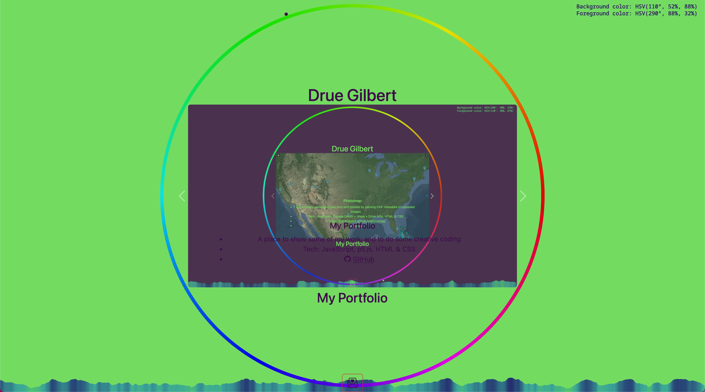

# The Portfolio of Drue Gilbert

Welcome to my portfolio. You can view it deployed on GitHub Pages
[here](https://caseinpoint.github.io/).

My name is Drue, and my pronouns are they/them. I'm a human being, maker,
nerd, teacher, and full-stack web developer. I built this page to showcase some
of my personal coding projects, things I find interesting and/or problems I've
needed to solve.

## Projects

- [13th Age Chaos Mage Spell App](./chaosmage/)
- [Photomap](./photomap/)
- [Knitting Row Counter App](./knitcounter/)
- [Student Lab Partner Generator App](https://github.com/caseinpoint/lab_partners)

## The colors, Duke, the colors!

As self-promotion is not one of my strengths or desires, I needed something fun
to code in order to motivate myself to get this portfolio thing out there in
the world. I came across the creative coding JavaScript library,
[p5.js](https://p5js.org/), and decided to add it to this project. You can find
the source code that I wrote [here](./static/js/index.js).

To begin with, I wanted to do something with color. I'm red-green
[colorblind](https://en.wikipedia.org/wiki/Color_blindness), so color
perception is something that's interesting to me. In investigating how colors
are displayed on a monitor, I learned about the cylindrical-coordinate color
model [HSV](https://en.wikipedia.org/wiki/HSL_and_HSV) (Hue, Saturation,
Value), and decided to play around with that.

Since Hue is an angle between 0° and 360°, I started by calculating the angle
between the x-axis and the line from the center of the page to the position of
the mouse, and setting that as the H value for the background color.

Saturation and Value are both percentages, but I wanted different approaches
for generating those numbers.

For Saturation, here's what I came up with:
1. I used p5's [mouseMoved](https://p5js.org/reference/#/p5/mouseMoved)
function to count how many times the mouse has moved and saved that to
a global `mouseFrames` variable
2. I took the modulo 360 of `mouseFrames` to get a number between 0° and 360°
3. I took the sine of that modulo to get the value going up and down in a wave
4. I used p5's [map](https://p5js.org/reference/#/p5/map) function to map the
original sine result range of -1 to 1 to a range of 40% to 100% for the S value
of the background color

And for Value, here's what I did:
1. I calculated the distance from the center of the page to the current mouse
position
2. I divided that distance by the width or height of the page, whichever is
currently smaller, and multiplied by 100 to get a percent
3. I used the p5 [constrain](https://p5js.org/reference/#/p5/constrain)
function to keep the result between 0 and 100, as it's possible to move the
mouse above 100% in some directions
4. I used p5's map function to map the result to a range of 30% to 90%, not too
dark and not to bright, for the V value of the background color

Then, for the forground color, I wanted to calculate the "opposite" color to
the background. For H, I just went 180° from the calculated background H. For
S, I multiplied the result of the sine by -1 and then mapped that to the 40% to
100% range. And for V, I subtracted the constrained distance percent from 100%
and mapped that to the 30% to 90% range. This results in a color that isn't
technically the exact opposite on the HSV model, but it's close to it while
staying within the ranges of values that I wanted.

The moving wave of colors along the bottom was another fun feature where I
learned some new things. I used p5's0.
[Perlin noise](https://p5js.org/reference/#/p5/noise) function with inputs of
the animation frame count and the current mouse position to generate the height
of the wave, and p5's
[color linear interpolation](https://p5js.org/reference/#/p5/lerpColor)
function from the background color to the foreground color based on the wave
height.

One last note about the colors: CSS doesn't support HSV, so I also wrote a
function to convert HSV to HSL in order to apply the forground color to text on
the page.
