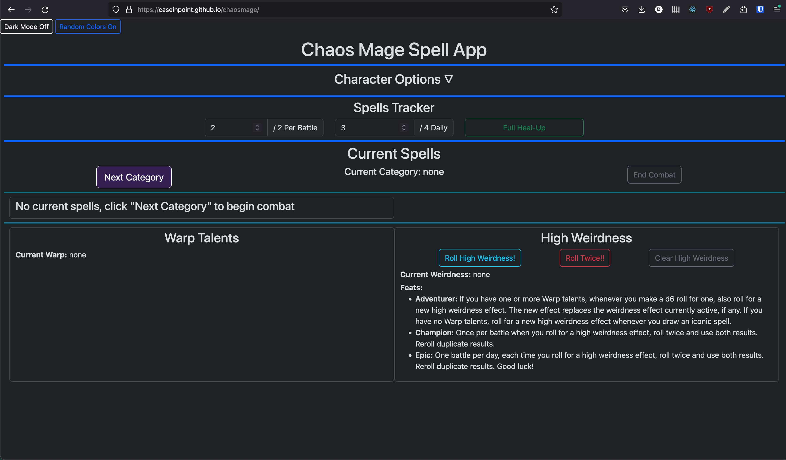
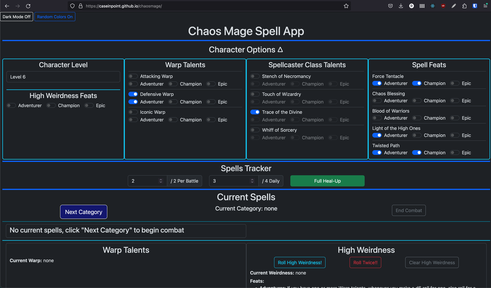
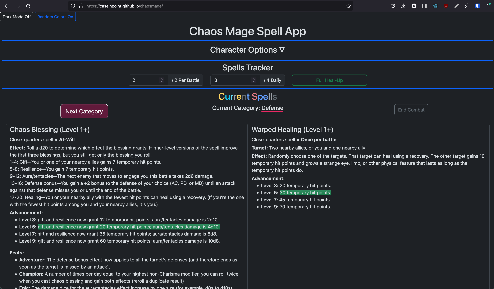
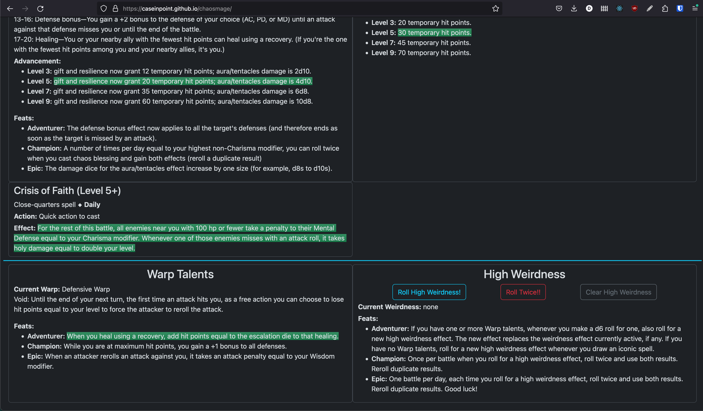
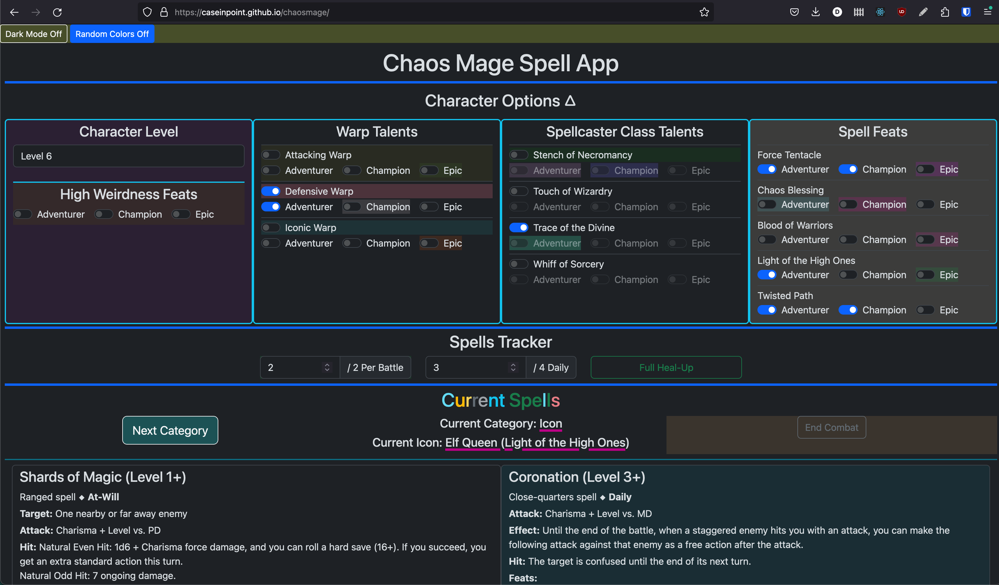
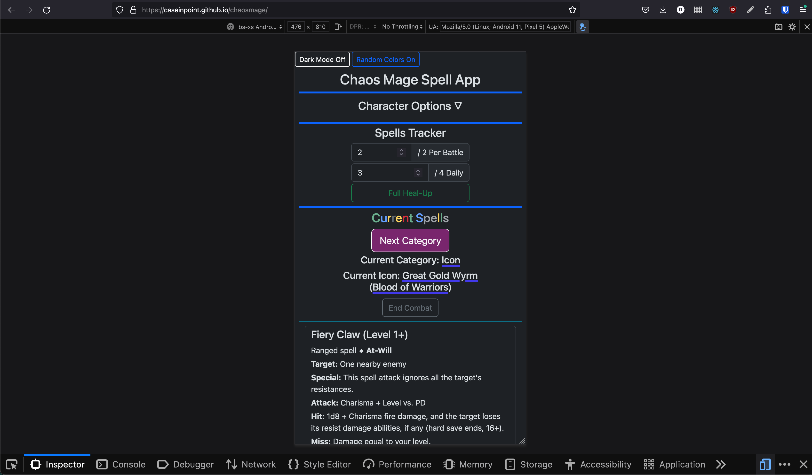

# [13th Age](https://pelgranepress.com/13th-age/) Chaos Mage Combat Tool

The **[Chaos Mage](https://www.13thagesrd.com/classes/chaos-mage/#Chaos_Magic)**
character class in 13th Age can be fun, but challenging, to play. During combat
the category of spell you can cast on any given turn is determined randomly.
Several other class features are determined randomly, as well, and they
interact in complex ways. So I built this web app to automate a lot of the
Chaos Mage combat randomness.

## Technologies Used:

- JavaScript, JSX, JSON, HTML, CSS
- [React](https://legacy.reactjs.org/docs/cdn-links.html) (legacy, via CDN)
- [Babel standalone](https://babeljs.io/docs/babel-standalone) (via CDN)
- [Bootstrap](https://getbootstrap.com/) (via CDN)

I chose React legacy and Babel standalone for lightweight deployment on GitHub
Pages, which you can view here:

### 🚀 [Deployed app](https://caseinpoint.github.io/chaosmage/)

## Description and Usage

The main React component, [ChaosMage.jsx](../static/jsx/ChaosMage.jsx), manages
state for several items that are shared across multiple components, and handles
rendering subcomponents.

Here you can see the collapsible **Character Options** menu component
([source code](../static/jsx/OptionsMenu.jsx)). I initially have this loading
from a default options JSON static file I created, but the component saves and
loads all changes to `localStorage` to persist user choices across sessions.
*(🚧 The feats associated with the Spellcaster Class Talents are not yet implemented 🏗️)*

The **Spells Tracker** component ([source code](../static/jsx/SpellsTracker.jsx))
loads the appropriate number of Per Battle and Daily spells for the saved
character level, and sets the label text as well as maximum values for the
inputs. The component persists all changes in `localStorage`.

The **Full Heal-Up** button resets both spell counts, as well as triggering
changes in other components via a state variable and function in the main
component:

- the current spell category is reset to `null`
- the current Warp and High Weirdness are also reset to `null`
- any random spells from other spellcaster classes, granted by certain Chaos
Mage talents, are reset and randomly selected again
- and all of the above are saved to `localStorage`

In the **Current Spells** component ([source code](../static/jsx/SpellsContainer.jsx)),
the **Next Category** button selects Attack, Defense or Icon spells based on
the random algorithm described in the rules. If Icon is selected, a random Icon
is also selected. The current selection, as well as the possible next
selections, is saved to `localStorage` to persist in case combat runs longer
than one game session. A fun feature to build was the random RGBa background
color of the button, that changes randomly every 1 to 6 (1d6) seconds.

Once the category has been chosen, the Current Spells component renders a
number of available **Spell Details** components ([source code](../static/jsx/SpellDetail.jsx)).
These components load the appropriate details from static JSON files I created
from the source books. They also highlight the appropriate level advancement
and feats, based off of the saved selections in the Character Options component.

If the Warp Talent corresponding to the current spell category is saved in the
Character Options, a random warp is chosen and displayed in the
**Warp and Weirdness** component ([source code](../static/jsx/WarpWeird.jsx))
at the bottom of the page. Likewise, if the character has the Adventurer tier
feat for High Weirdness, that table is rolled and the result displayed.

:rainbow: Another fun feature I implemented is the
**Random Colors On** button ([source code](../static/js/randColors.js)). Every
2 to 12 (2d6) seconds, every `
` on the page has a 1 in 6 (1d6) chance of
being assigned a random RGBa background color. The variable delay is achieved
by recursively calling the delay function from within the `setTimeout` callback.

Finally, I implemented Bootstrap's grid system and breakpoints to make this
tool responsive and useable on phones, tablets and desktops.
