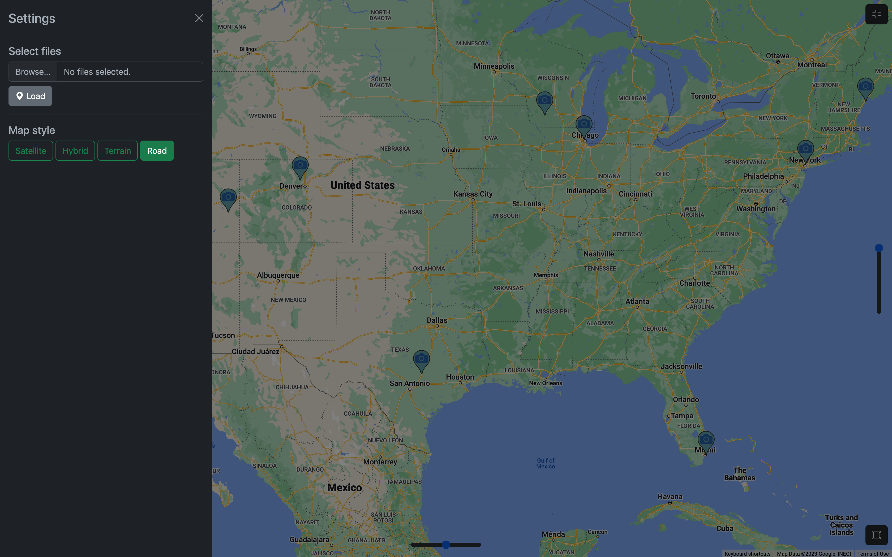

# Photomap

**Photomap** is a demo project that places images on a map based on GPS
locations in their EXIF metadata.

Techonologies used:
- HTML, CSS, JavaScript
- [Bootstrap](https://getbootstrap.com/), [Bootstrap Icons](https://icons.getbootstrap.com/)
- [Google Maps JavaScript API](https://developers.google.com/maps/documentation/javascript/overview)
- [Google Drive API](https://developers.google.com/drive/api/guides/about-sdk)
- [Exif.js](https://github.com/exif-js/exif-js)

## V1

🚀 **Version 1 is deployed [here](https://caseinpoint.github.io/photomap/).**

🚧 *Currently, version 1 is not working on mobile. More testing is needed.*

After initializing the Google Map and adding custom controls, I implemented an
`<input type="file">` in the settings offcanvas which allows users to select
image files from their local machine to display on the map.

My script [photomap-v1.js](../static/js/photomap-v1.js) then parses the
locations and adds custom markers to the map.

To keep the markers from overlapping, I implemented
[clustering](https://developers.google.com/maps/documentation/javascript/marker-clustering).

A modal opens when the user clicks on a marker. The image associated with that
location is displayed, along with some of its metadata, and a buttons to zoom
the map to that location and cycle through the photos that have been loaded.

Custom controls implemented:
- Settings offcanvas toggle (upper left)
- Map style selection (settings offcanvas)
- Fullscreen toggle (upper right)
- Recenter button (bottom right)
- Tilt slider (center right)
- Rotation slider (bottom center)
- Zoom to photo coordinates button (image modal)
- Cycle through images (image modal)

## V2

Instead of opening local files, version two implements the
[Google Drive API](https://developers.google.com/drive/api/guides/about-sdk) to
retrieve files from the cloud. I initially started with the Google Photos API,
but the images do not include the location data. Users can find instructions
and a list of available "albums" in the settings offcanvas.

Version 2 is deployed [here](https://caseinpoint.github.io/photomap/v2.html).
🚧 However, the Google OAuth is still in "testing" mode, so only specific test
users can access it at this time.
